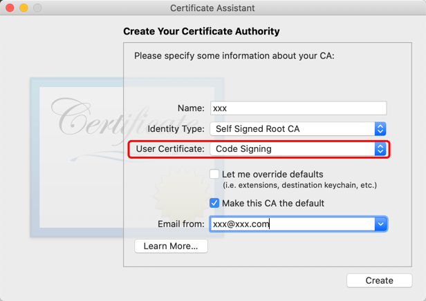

+ 方法来自[Navicat Keygen](https://github.com/DoubleLabyrinth/navicat-keygen/blob/mac/README.zh-CN.md) ,已经`fork`；
github已经被封，可以区gitee上搜索下同名项目

+ Navicat Premium For Mac 12.1.21 ***简体中文版*** 已通过测试
    - &#10003; navicat121_premium_cs.dmg
    - &#10008; ~~navicat121_premium_en.dmg~~

+ 仅对 Navicat Premium 版本 < 12.0.24 的说明：

    如果你的Navicat版本小于12.0.24，那么navicat-patcher将会终止并且不会修改目标文件。
    
    你必须使用openssl生成RegPrivateKey.pem和rpk文件：
    
        $ openssl genrsa -out RegPrivateKey.pem 2048
        $ openssl rsa -in RegPrivateKey.pem -pubout -out rpk
    接着用刚生成的rpk文件替换
    
        /Applications/Navicat Premium.app/Contents/Resources/rpk
    
+ 生成一份自签名的代码证书，并总是信任该证书；创建证书颁发机构时，名称和电子邮件地址随便写
  - 在 Mac 上的“钥匙串访问”中创建自签名证书
  - 在 Mac 上的“钥匙串访问” App 中，选取“钥匙串访问”>“证书助理”>“创建证书颁发机构”。
  - 选择"代码签名"的用户证书
    
         
+ 下载Navicat Premium中文版：https://www.navicat.com.cn/download/navicat-premium ，破解时，选择Simplified Chinese语言

+ 关掉自动升级吧，省的再次破解

参考[^1][^2][^3]

[^1]:https://www.zhb127.com/archives/macos-navicat-keygen.html
[^2]:https://www.zhb127.com/archives/macos-codesign-gdb.html
[^3]:https://www.jianshu.com/p/54c2a8c62ee5